# Lab Report Week 1: Running Commands on a Course-Specific Account (ieng6) on a Server (Windows Local Computer)
On this page, we will go over how to log in and run certain commands on a course-specific account (@ieng6.ucsd.edu) connecting to a server. Specifically, we will look at how to browse through directories, read files, copy files from our local computer, and streamline commands. 

All work done is done through [Visual Studio Code](https://code.visualstudio.com/), which you can download through the link. I had already set this up through a previous class. 

## Part 1: Connecting to the Server
You will first want to find your account through [here](https://sdacs.ucsd.edu/~icc/index.php). If it is your first time, reset your password. (Keep in mind this WILL reset your TritonLink/email password as well, so change it to something you will remember and use. You will not be able to use any old passwords.) Wait around 15 minutes or until you get kicked out of your Google account to ensure your password was changed.

You may then open up a terminal in VS Code and enter the following ssh command (your @ieng6.ucsd.edu address is specific to you):
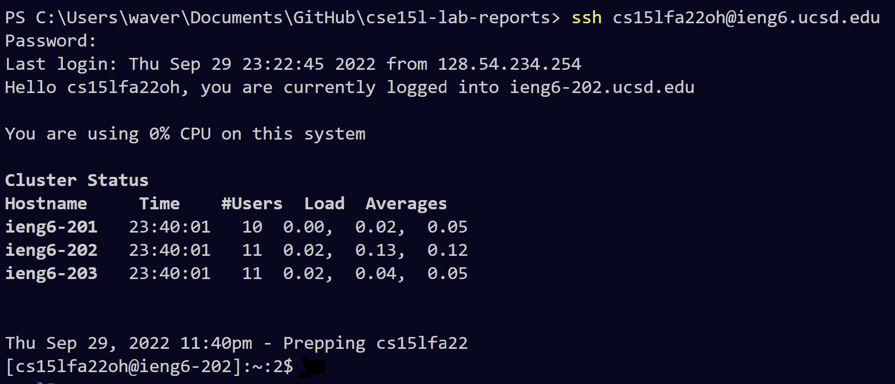
It will prompt you to enter your password (which will not give you any feedback) and then will print the following information when you have logged in.\
Any commands you run in this server will have your account ID in brackets following the command.

To logout, simply type "exit" in the terminal:
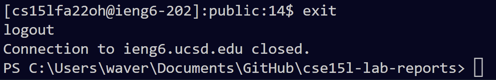
It will display this message once logged out and you will see tje local directory.

## Part 2: Running Some Basic Commands
Below are examples of a couple of commands running within the server. You can switch directories (cd), go back a directory (..), read files (cat), and list files in a directory (ls).
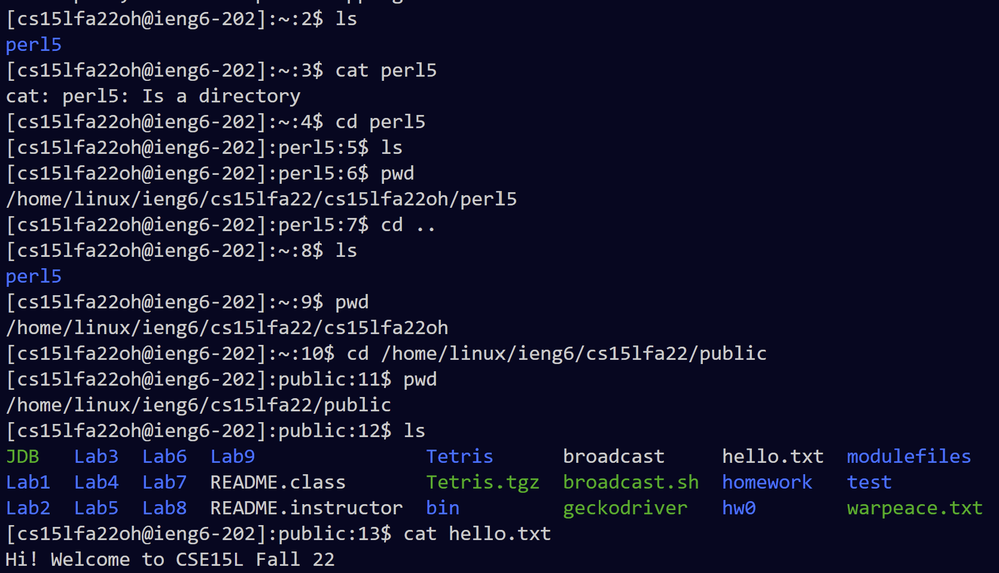

## Part 3: Copying a File from a Local Directory
Lets say we want to copy the file "WhereAmI.java" from our local directory:
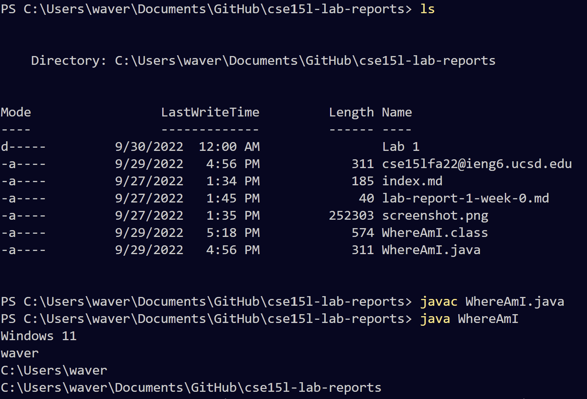
Notice that we are in our local directory to start. This is important. \
We can then use the scp command to copy a file as follows:
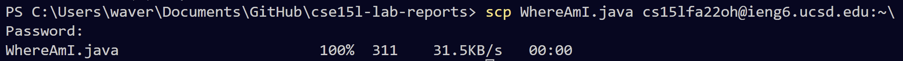
As soon as we run this command and enter the password, we can log back in and read the file.
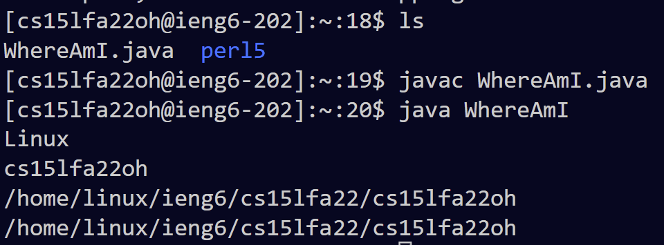
Now we can run the file in the server (notice the difference in output based on the server, this is due to getProperty in the java file).

## Part 4: Setting a Save Key (a.k.a getting rid of the password) (Windows Specific)
If we have to keep switching between the local directory and the server, it becomes a hassle to enter the password everytime. Luckily, we have a setup for that. We simply create a save key like below:
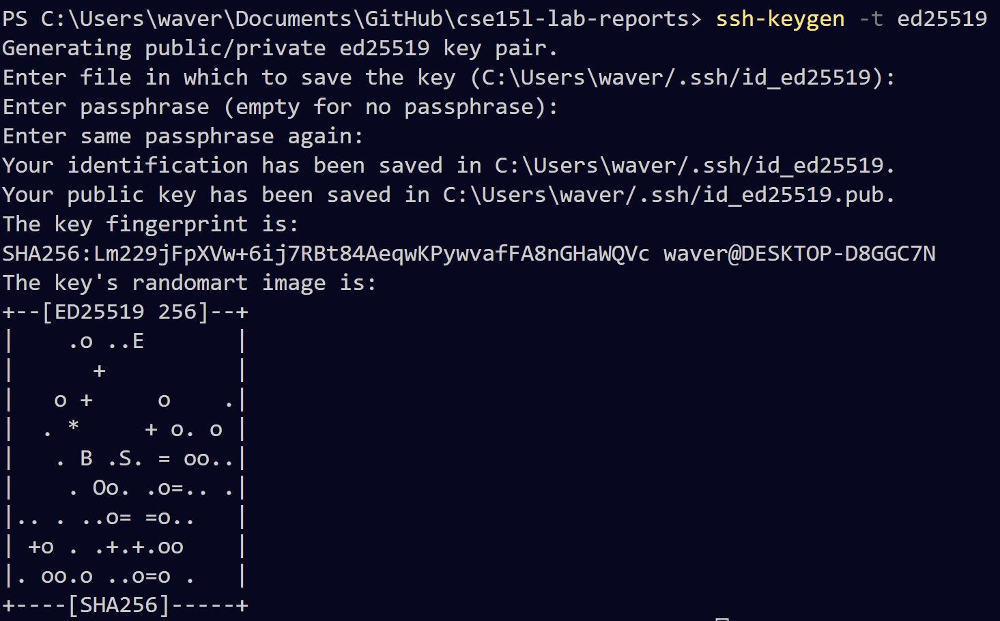
The only thing that is physically entered is the ssh-keygen line. Everything else is just skipped (i.e. click Enter) until the key is created. \
Then, you open an elevated powershell by running Windows Powershell as an administrator:
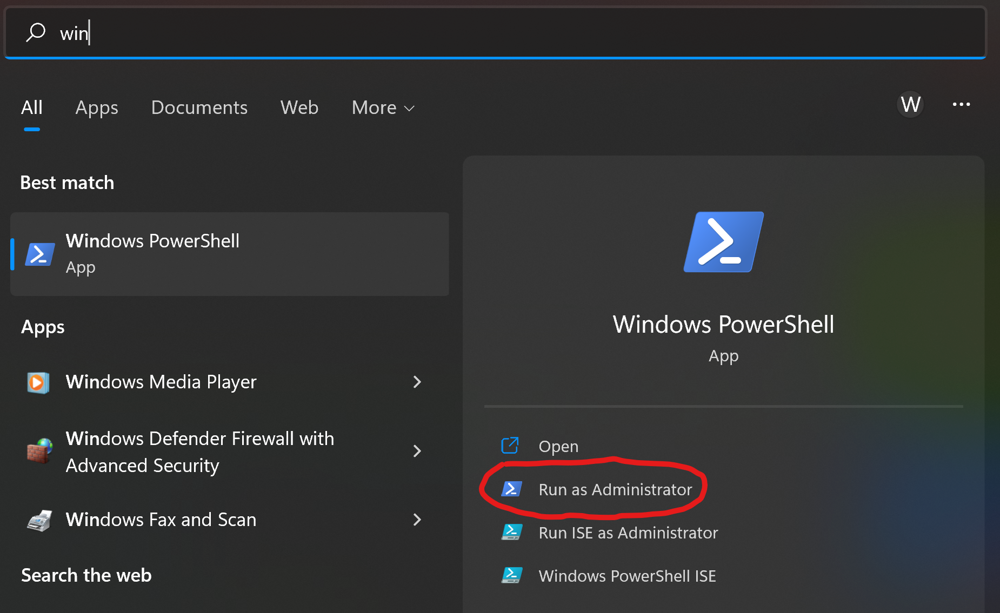
and enter the following into the powershell:
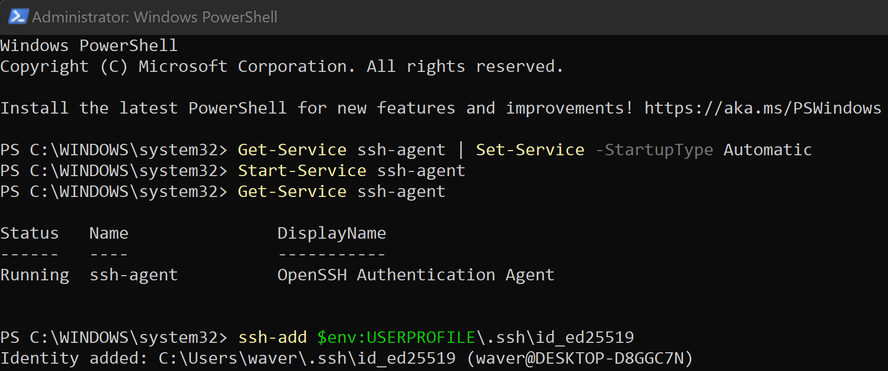
You can then go back to your VS Code terminal and do the following to set it up:
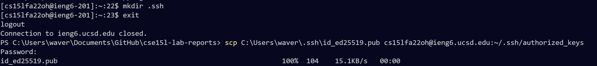 
Now, whenever we login on this particular computer, we are not prompted to enter a password:
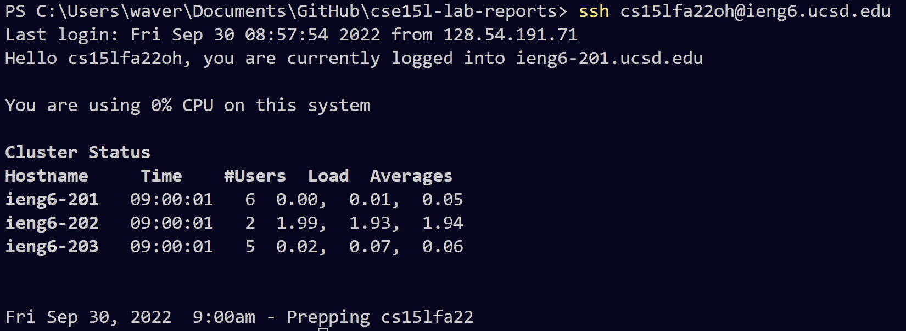
## Part 5: Streamlining Commands
Now that we do not have to enter a password, we can streamline commands much faster. For example, if we want to upload the file from the local directory onto the server as we did in **Part 3**, we can run all the commands on one line:
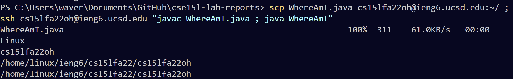
Each line is separated by a semicolon instead of a line break, and anything done in the server can be placed in quotes following the ssh login. \
Lets say we want to edit the file in the server to say "CURRENT SYSTEM PROPERTIES:" before the output. Since we cannot edit it in the server, we can edit it in our local directory and then reupload it. We can simply doing this by editing the file, then pressing the up arrow to run the last command (which is all the commnads in one line as shown in the previous image), hit enter, and it will change it:
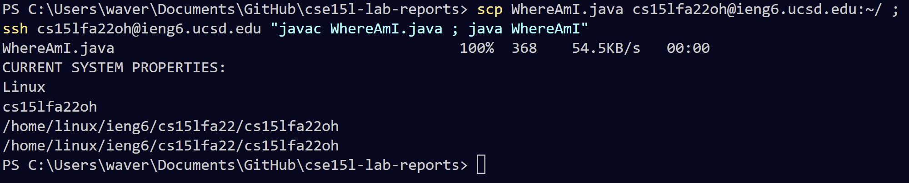
We can rerun this command over and over again to make file changes much easier to upload to the server.