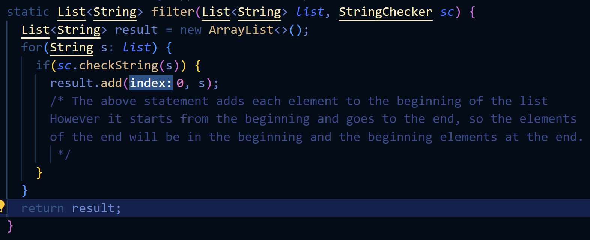

# Lab Report 2: Making a Search Engine and Catching Bugs Using JUnit (Console)
On this page, I will present my code for the search engine and explain how the website works. Then, I will explain two bugs I found in implementations of code as well as showcase how I fixed them. 

## Part 1: The Search Engine

The following is the code for **SearchEngine.java**. This file, combined with **Server.java** (the same one that runs other websites), will create and run a website on a host/server. 
```
import java.io.IOException;
import java.net.URI;
import java.util.ArrayList;

class Handler implements URLHandler {
    ArrayList<String> list = new ArrayList<>();

    public String handleRequest(URI url) {
        if(url.getPath().equals("/")) {
            return "New Empty List Created!";
        }
        else if(url.getPath().contains("/add")) {
            if(url.getQuery().contains("s=")) {
                String[] parameters = url.getQuery().split("=");
                this.list.add(parameters[1]);
                return "String \"" + parameters[1] + "\" Added!";
            }
            else {
                return "Missing Query!";
            }
        }
        else if(url.getPath().contains("/search")) {
            if(url.getQuery().contains("s=")) {
                String[] parameters = url.getQuery().split("=");
                ArrayList<String> searched = new ArrayList<>();
                for(int i = 0; i < this.list.size(); i++) {
                    if(this.list.get(i).contains(parameters[1])) {
                        searched.add(this.list.get(i));
                    }
                }
                if(searched.size() == 0) {
                    return "No Matching Strings Found!";
                }
                else {
                    String returned = searched.get(0);
                    for(int i = 1; i < searched.size(); i++) {
                        returned = returned + ", " + searched.get(i);
                    }
                    return returned;
                }
            }
            else {
                return "Missing Query!";
            }
        }
        return "404 not found!";
    }
}

class SearchEngine {
    public static void main(String[] args) throws IOException {
        if(args.length == 0){
            System.out.println("Missing port number! Try any number between 1024 to 49151");
            return;
        }

        int port = Integer.parseInt(args[0]);

        Server.start(port, new Handler());
    }
} 
```
When the server is created, the first part (the if statement) of the *handleRequest()* method is called. Because there is no other path following the domain, the path is empty and the code will display the following:
 

Let's add a string into the query. In our URL, we will go to the path called "add" and then call a query of s=onto. This will call upon the second portion of the *handleRequest()* method (else if statement), which will add the queried string into the list and print out the following statement. \


In the following screenshot, we have already added a couple of strings to the list. If we want to search for all the strings in the list that have an "a", we can call the search path and pass the query of s=a and it will spit out a list of all the words with "a" separated by commas:
 \
It is worth noting that if either of these paths do not contain a query, the website will spit out "Missing Query!". 

## Part 2: Finding Bugs

### 1) ArrayExamples.java

In ArrayExamples.java, there is a method that returns the average of the list with the lowest number omitted. However, it fails when there are multiple instances of the lowest number, like in the following test:

While we expect the value to be the average of 1, 5, 6, 3, and 9, which is 4.8, we get the following output:

The reason can be seen in the method (see the comment):

So, instead of taking the average of 1, 5, 6, 3, and 9, it is taking the average of 5, 6, 3, and 9 instead and spitting out a wrong answer. \
We can fix this, however, by setting a boolean so that as soon as the first instance of the lowest number is created, we can add all other instance of the lowest number, as follows:

This will make our test run successfully. 

### 2) ListExamples.java

In ListExamples.java, there is a method that filters a list based on a certain StringChecker and spits out a filtered list in the same order. However, it fails whenever there are 2 or more items in the list that fulfill the checker, like in the following test: 

While we expect our new list to be {"apple", "banana"}, we get the following output:

The reason can be seen in the method (see the comment):

So instead of spitting it out in order, it will spit it out in reverse order, and our resulting output is {"banana", "apple"}. \
We can fix this, however, by creating an index that will increase each time something is added to the list so that it will not keep adding it at the beginning, as follows:

This will make our test run successfully. 