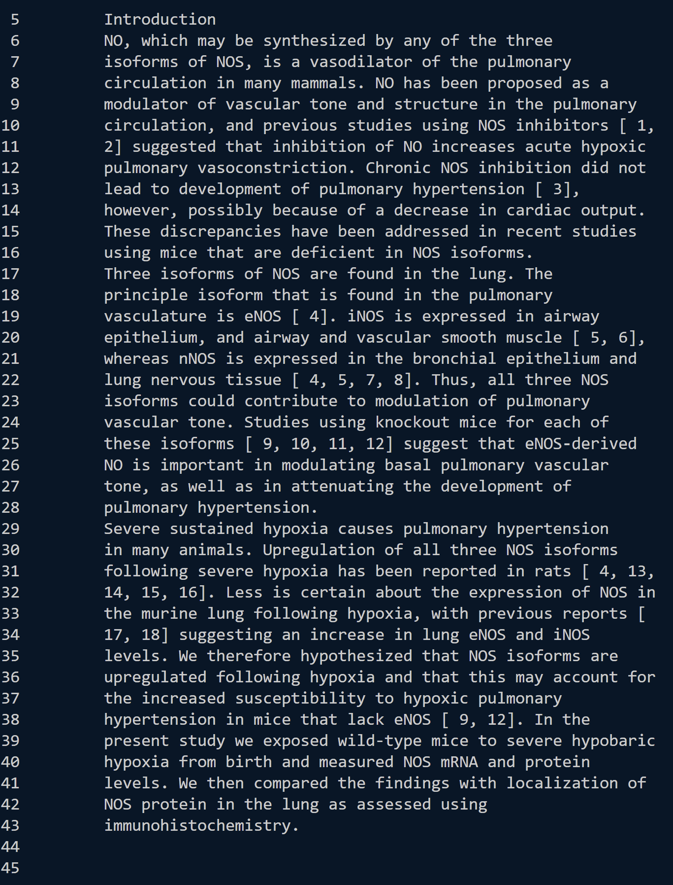
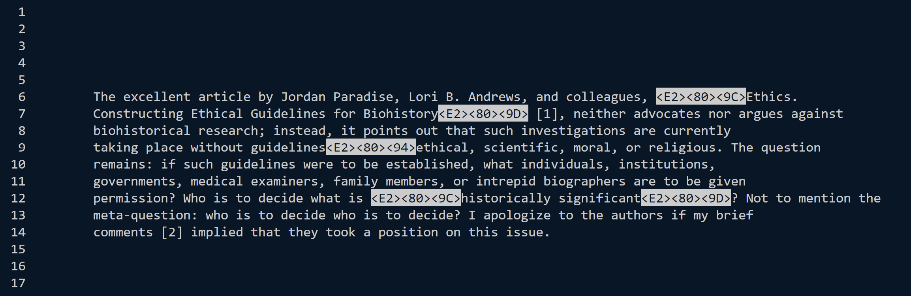
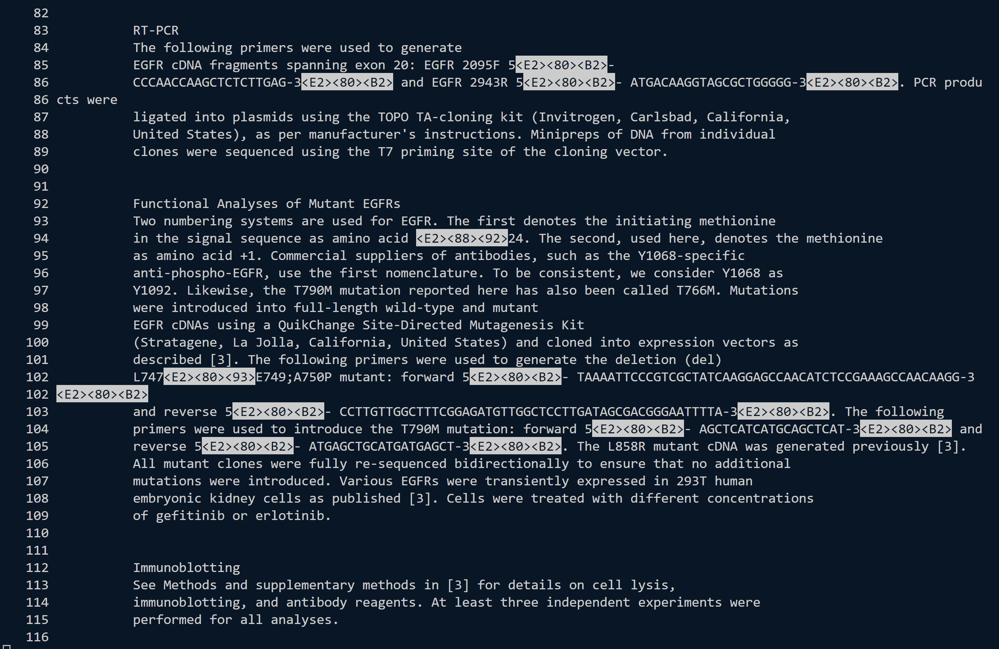
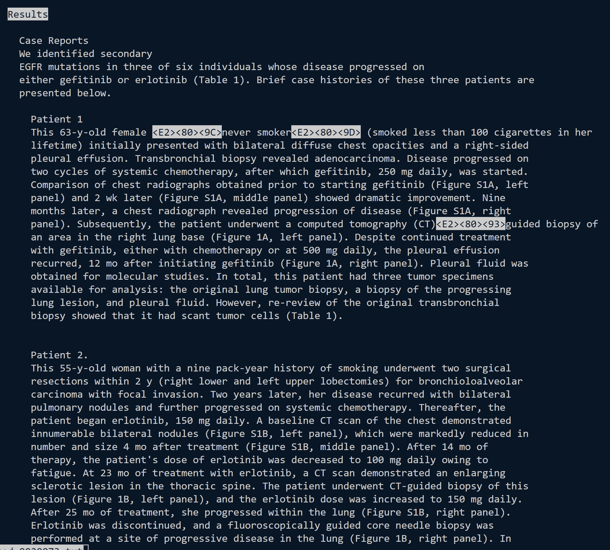
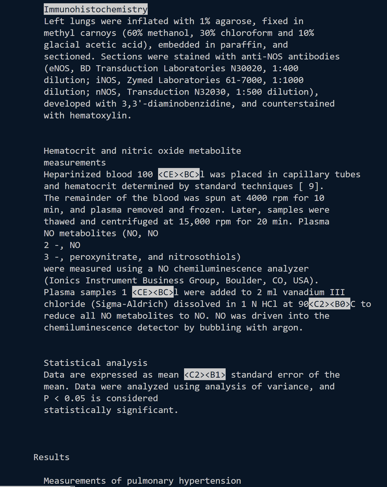
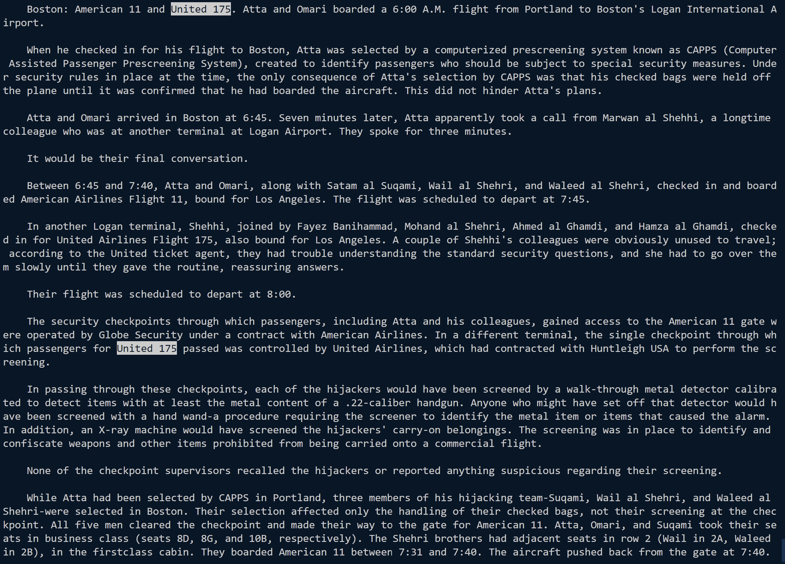
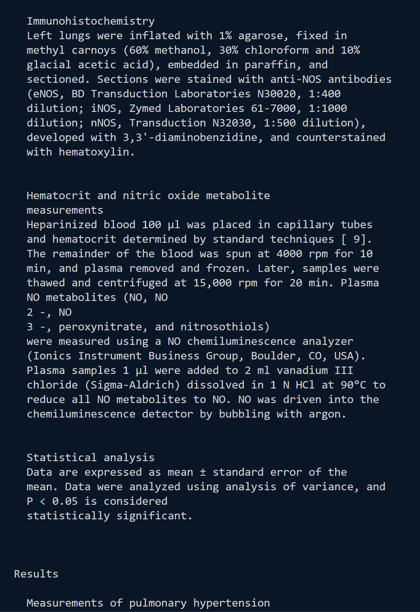
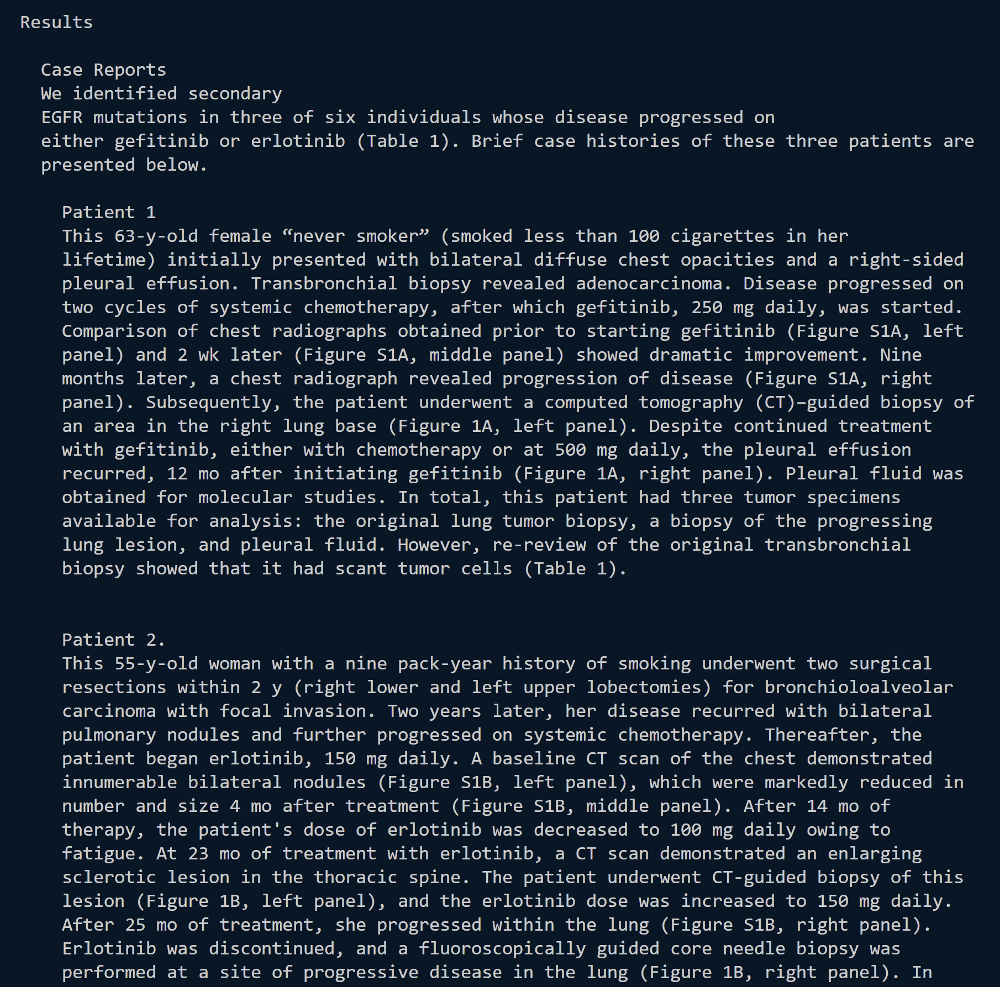
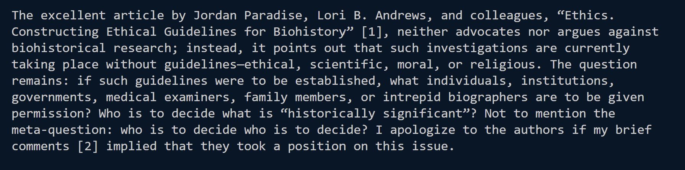

# Lab Report Week 5
In this lab, we explore the different options within terminal commands. I chose to explore the `less` command.

Current Directory: `docsearch/technical`

## `less -N`
This particular command spits out the document but adds line numbers as well. 

```
$ less -N biomed/rr74.txt
```

This command prints out the file with line numbers of `biomed/rr74.txt`. This is useful because we can refer to the file by line number if needed.

```
$ less -N plos/pmed.0020191.txt
```

This command prints out the file with line numbers of `plos/pmed.0020191.txt`. While this is a short file, we can now see the line numbers, which allows us to see that the text does not start on line 1 and ends before line 17. 

```
$ less -N plos/pmed.0020073.txt
```


This command prints out the file with line numbers of `plos/pmed.0020073.txt`. One of the things we can notice is that some line numbers show up twice, which indicates that the screen width did not fit the entire width of the line, so therefore it spilled onto the next line (see lines 86 and 102). 

## `less -p(argument)`
This particular command will automatically skip to the first instance of the "argument" passed within the document and highlight the rest of the instances, allowing us to scroll and find all the instances of a certain argument.

```
$ less -pResults plos/pmed.0020191.txt
```

This particular command allows us to find the first instance of "Results" in `plos.pmed.0020191.txt`. Because, in this instance, "Results" is actually a section header, we can skip to that section. 

```
$ less -pImmunohistochemistry plos/biomed/rr74.txt
```

This particular command allows us to find the first instance of "Immunohistochemistry" in `plos.pmed.0020191.txt`. "Immunohistochemistry" is also a section header, so we can skip to this section and see what exactly it means and what it entails. 

```
$ less -p"United 175" 911Report/chapter-1.txt
```


This particular command allows us to find the instances of "United 175" in `911Report/chapter-1.txt`. While "United 175" is not a section header, we can find all instances of this particular flight, as this command will find all instances. 

## `less -r`
In some of the previous examples, there are also highlighted portions with characters with "<>" (unicode) around it. These are unable to be displayed by just using `less`, but with the addition of `-r`, these characters can be recognized and printed. 

```
$ less -r biomed/rr74.txt
```

(Refers to the result of the second example of `less -p`) \
Compared to the referred example mentioned above, we can see that, in `biomed/rr74.txt`, "\<CE>\<BC>" was the symbol for microliters, and "\<C2>\<B0>" was the symbol for degree.

```
$ less -r plos/pmed.0020073.txt
```

(Refers to the result of the third example of `less -N`) \
Compared to the referred example mentioned above, we can see that, in `plos/pmed.0020073`, "\<E2>\<80>\<9C>" and "\<E2>\<80>\<9D>" were the symbols for open and closed quotes, respectively, and "\<E2>\<80>\<93>" was a "-".

```
$ less -r plos/pmed.0020191.txt
```

(Refers to the result of the second example of `less -N`) \
Compared the the referred example mentioned above, in `plos/pmed.0020191.txt`, all the quotes have now been displayed.