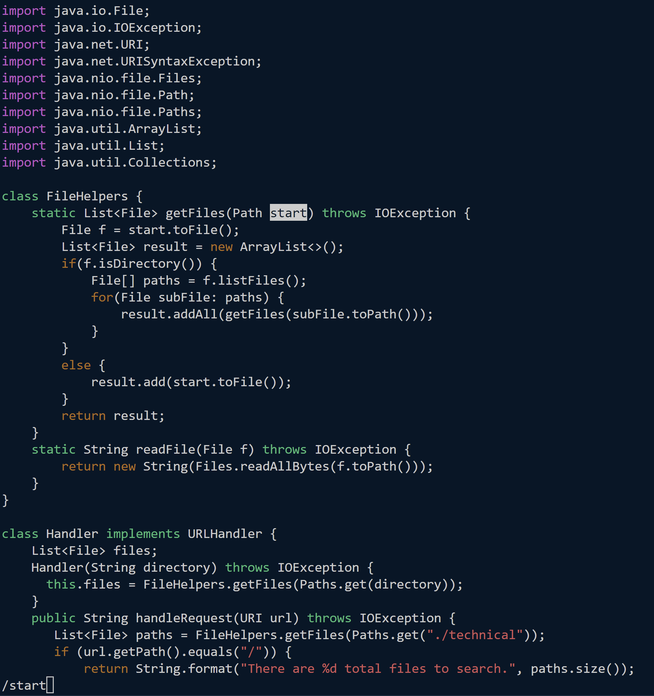
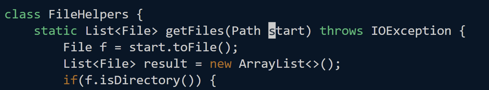
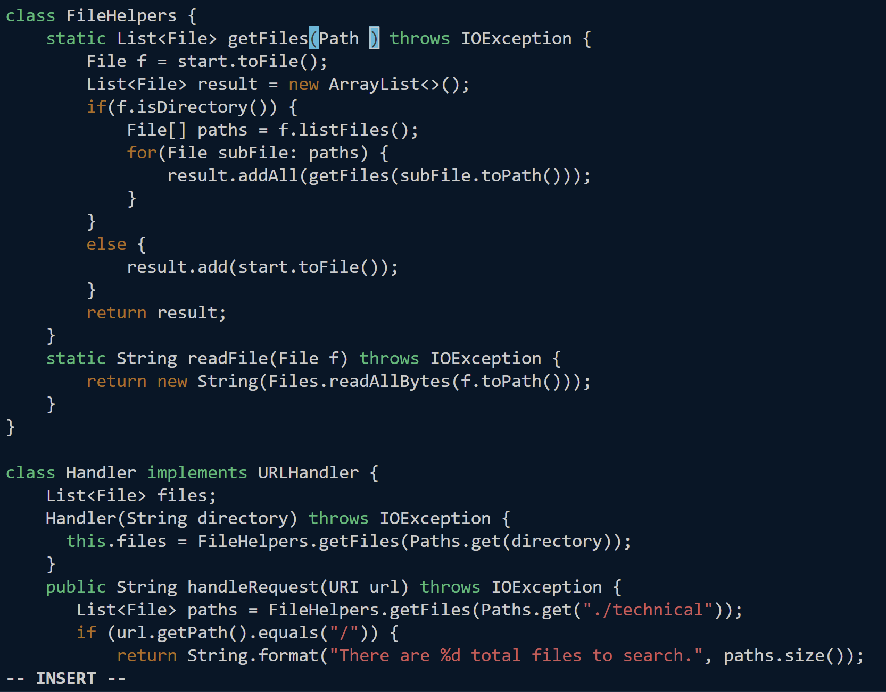
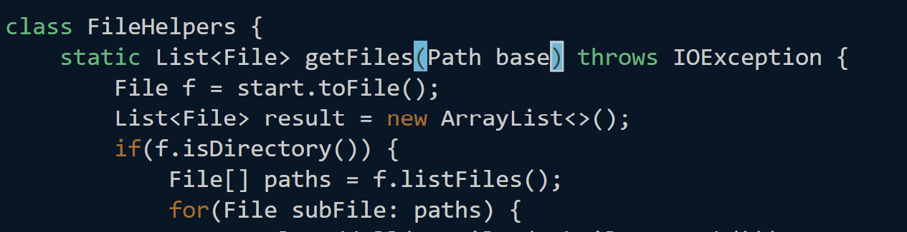
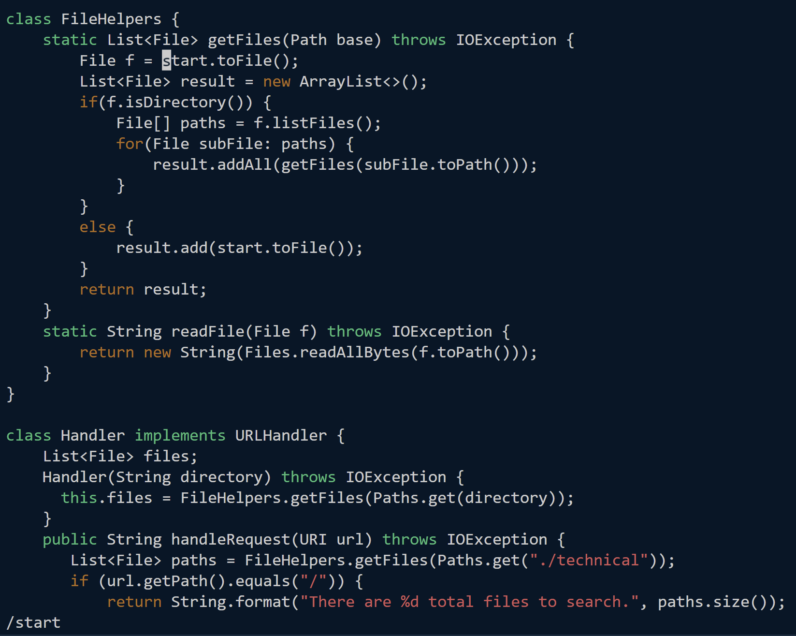
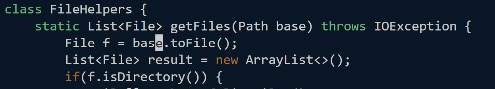
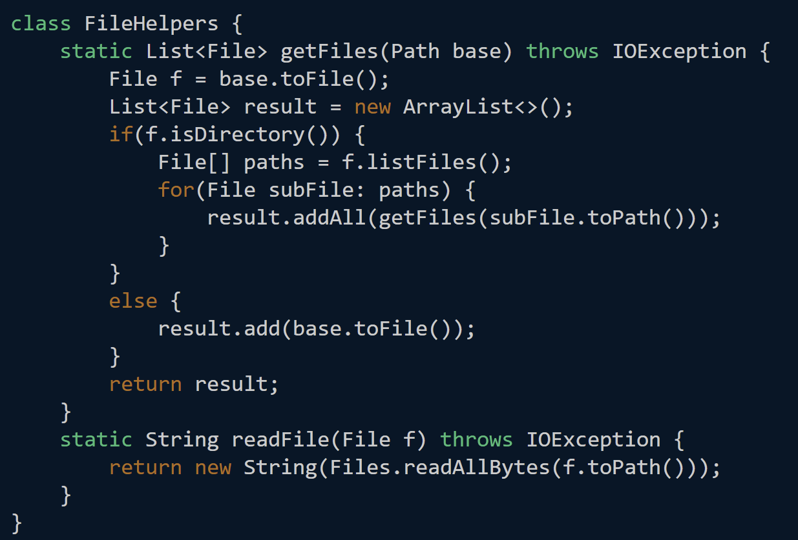

# Lab Report Week 7
In this lab report we explore how to use ```vim``` to change files. 

## Part 1: ```start``` parameter to ```base```

The sequence of code I used to perform this command is as follows:

```
/start <enter> ce base <esc> n . n . n .  :wq <enter>
```
Our first set of keys, ```/start <enter>```, will find all the instances of the word (and therefore the variable) ```start```, allowing us to reach each one with ease. Pressing enter lets our cursor move to this location.

*We have found the first instance of ```start```.*
 
*Pressing ```<enter>``` moves our cursor there.* 

\
The keys ```ce base``` allow us to replace the word to base. ```ce``` allows us to replace the word from the location of the cursor until the end of the word, but since our cursor is at the front of the word, it will change the whole word. We are then in insert mode and can change the variable to ```base```. Pressing ```<esc>``` will take us out of insert mode. 

*```ce``` gets rid of the entire word and leaves the cursor where it is. We can see at the bottom that we are in insert mode.*
 
*We can then type ```base``` to replace the word.*

\
We can then press ```n .``` repeatedly until each instance of ```start``` has been change. ```n```, which is related to our call to search (```/```) we made earlier, will bring the cursor to all the instances of ```start```, and the ```.``` will repeat the last command we did, which, in our case is ```ce base``` (changes the word to base). 

*Typing ```n``` has found the next instance of ```start```.*
 
*Typing dot repeats the change command we did previously.*

*All instances of ```base``` have now been changed.*

\
We can then press ```:wq <enter>``` to save and quit.

## Part 2: Timing: ```vim``` vs ```scp```

Editing with vim: 0:41 \
Editing with scp: 1:16 \
(times are in minutes) 

\
It would take time to get used to all the commands ```vim``` has, but to run remotely it would be much easier to use ```vim``` rather than ```scp``` because it allows us to not worry about the directory the file has to go into when being copied. \
I think the reason above (running remotely) would make me lean towards using ```vim``` when having to run programs remotely. Since I have a windows computer, however, I would not use ```vim``` to edit local files, so if that was a necessary part of the task I would ```scp```.