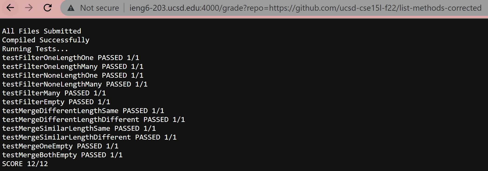
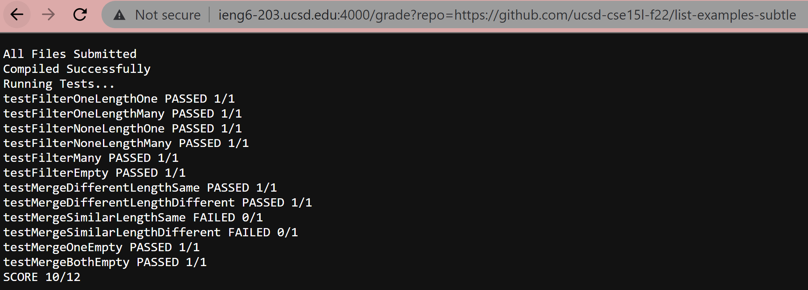
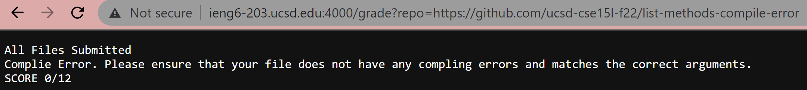

# Lab Report Week 9
In this lab report, we examine the functionality of my bash script grade file.

## Part 1: ```grade.sh```
```
# Create your grading script here


rm -rf student-submission
git clone --quiet  $1 student-submission


# test for correct file

if [[ -f student-submission/ListExamples.java ]]
then  echo "All Files Submitted"
else
        echo "Wrong File Submitted. Ensure that the file is not in a folder and the filename is correct."
        echo "SCORE 0/12"
        exit 1
fi

cp TestListExamples.java student-submission/
cp -r lib student-submission/
cd student-submission


# test for compiling
javac -cp .:lib/hamcrest-core-1.3.jar:lib/junit-4.13.2.jar *.java  2> err.txt
if [[ $? -eq 0  ]]
then
        echo "Compiled Successfully"
else
        echo "Complie Error. Please ensure that your file does not have any compling errors and matches the correct arguments."
        echo "SCORE 0/12"
        exit 1
fi

# running tests

echo "Running Tests..."

java -cp .:lib/hamcrest-core-1.3.jar:lib/junit-4.13.2.jar org.junit.runner.JUnitCore TestListExamples 1> run.txt  2> runErr.txt

SCORE=0

if grep -q  "test1_" run.txt
then echo "testFilterOneLengthOne FAILED 0/1"
else
        echo "testFilterOneLengthOne PASSED 1/1"
        SCORE=$(($SCORE+1))
fi
if  grep -q "test2" run.txt
then echo "testFilterOneLengthMany FAILED 0/1"
else
        echo "testFilterOneLengthMany PASSED 1/1"
        SCORE=$(($SCORE+1))
fi
if grep -q "test3" run.txt
then echo "testFilterNoneLengthOne FAILED 0/1"
else
        echo "testFilterNoneLengthOne PASSED 1/1"
        SCORE=$(($SCORE+1))
fi
if grep -q "test4" run.txt
then echo "testFilterNoneLengthMany FAILED 0/1"
else
        echo "testFilterNoneLengthMany PASSED 1/1"
        SCORE=$(($SCORE+1))
fi
if grep -q "test5" run.txt
then echo "testFilterMany FAILED 0/1"
else
        echo "testFilterMany PASSED 1/1"
        SCORE=$(($SCORE+1))
fi
if grep -q "test6" run.txt
then echo "testFilterEmpty FAILED 0/1"
else
        echo "testFilterEmpty PASSED 1/1"
        SCORE=$(($SCORE+1))
fi
if grep -q "test7" run.txt
then echo "testMergeDifferentLengthSame FAILED 0/1"
else
        echo "testMergeDifferentLengthSame PASSED 1/1"
        SCORE=$(($SCORE+1))
fi
if grep -q "test8" run.txt
then echo "testMergeDifferentLengthDifferent FAILED 0/1"       
else
        echo "testMergeDifferentLengthDifferent PASSED 1/1"    
        SCORE=$(($SCORE+1))
fi
if grep -q "test9" run.txt
then echo "testMergeSimilarLengthSame FAILED 0/1"
else
        echo "testMergeSimilarLengthSame PASSED 1/1"
        SCORE=$(($SCORE+1))
fi
if grep -q "test10" run.txt
then echo "testMergeSimilarLengthDifferent FAILED 0/1"
else
        echo "testMergeSimilarLengthDifferent PASSED 1/1"      
        SCORE=$(($SCORE+1))
fi
if grep -q "test11" run.txt
then echo "testMergeOneEmpty FAILED 0/1"
else
        echo "testMergeOneEmpty PASSED 1/1"
        SCORE=$(($SCORE+1))
fi
if grep -q "test12" run.txt
then echo "testMergeBothEmpty FAILED 0/1"
else
        echo "testMergeBothEmpty PASSED 1/1"
        SCORE=$(($SCORE+1))
fi
echo "SCORE ${SCORE}/12"
```

## Part 2: Repositories Tested
***Repository 1: Corrected***

***Repository 2: Subtle***

***Repository 3: Complie-Error***


## Part 3: Trace of Test on the "Subtle" Repository
```
rm -rf student-submission
```
This is a silent command, but what this command does is that it removes any existing student-submission directory and all its files. This command is successful as we have an existing directory from previous runs and this command is able to remove them. \
**EXIT CODE:** 0
```
git clone --quiet  $1 student-submission
```
This command clones the repository in the given argument (represented by ```$1```). Usually, the output would show the progression of the clone and, since in this case it was successful, would tell us that the clone was successful. However, the addition of ```--quiet``` to the code makes it so that this output does not get printed.\
**EXIT CODE:** 0
```
if [[ -f student-submission/ListExamples.java ]]
```
Here we have a command within an if statement. ```-f``` searches that the specific path ```student-submission/ListExamples.java``` exists. In our case this does exist. \
**EXIT CODE:** 0 \
Because the exit code is 0, our if statement is fulfilled. \
**IF STATEMENT EVALUATION:** True
```
then  echo "All Files Submitted"
```
This command prints out "All Files Submitted". In our case, this text will successfully print out. \
**EXIT CODE:** 0 \
Because the if statement is true, the else portion does not run in this case.

````
cp TestListExamples.java student-submission/
````
This is a silent command, but what this command does is that it copies the test java file I created (currently in the parent directory ```list-examples-grader```) into the ```student-submission``` directory with the student's code in it. In this run, the file will successfully copy. \
**EXIT CODE:** 0
```
cp -r lib student-submission/
```
This is a silent command, but what this command does is that it copies the lib directory (```-r``` will allow us to copy directories) that currently exists in the parent directory ```list-examples-grader```) into the ```student-submission``` directory with the student's code in it. This will allow us to run JUnit tests within this directory. this In this run, the directory will successfully copy. \
**EXIT CODE:** 0
```
cd student-submission
```
This is a silent command, but what this command does is that it goes into the subdirectory ```student-submission``` and makes it the working directory. This command is successful. \
**EXIT CODE:** 0
```
javac -cp .:lib/hamcrest-core-1.3.jar:lib/junit-4.13.2.jar *.java  2> err.txt
```
This is a silent command, but what this command does is that it compiles all the java files within the working directory. The error is stored into a .txt file, however, because this command is successful there is nothing copied to this file. \
**EXIT CODE:** 0
```
if [[ $? -eq 0  ]]
```
This if statement evaluates if the previous exit code is equal to 0, indicating it testing if the previous command ran without any errors. From our previous line of code, we see that ```$?``` is 0, which fullfills this if statement. \
**IF STATEMENT EVALUATION:** True \
The command inside the brackets did not throw any errors and ran successfully.\
**EXIT CODE:** 0
```
then
        echo "Compiled Successfully"
```
This statement will print out "Compiled Successfully" if the if statement holds true. Our if statement is true, so this will print out. There are no errors in printing this out. \
**EXIT CODE:** 0 \
Because the if statement is true, the else portion does not run in this case.
```
echo "Running Tests..."
```
This statement prints out "Running Tests..." to indicate that the tests will now start running. There are no errors in printing this out. \
**EXIT CODE:** 0
```
java -cp .:lib/hamcrest-core-1.3.jar:lib/junit-4.13.2.jar org.junit.runner.JUnitCore TestListExamples 1> run.txt  2> runErr.txt
```
This statement will run the tests within the java file on the student's file. There will be no errors in running it, so ```runErr.txt``` will be empty and ```run.txt``` will have the results of the tests, regardless as to if they failed or not. \
**EXIT CODE:** 0
```
SCORE=0
```
This statement, though silent, initializes a variable called ```$SCORE``` which starts at 0. This successfully runs. \
**EXIT CODE:** 0 \
\
***TEST EVALUATION***: The following 3 code blocks represent the general structure for all 12 tests. 
```
if grep -q  "test_NUMBER_" run.txt
```
This command will test to see if ```run.txt``` contains the test number. ```run.txt``` will only contain the test number if the test failed, as the output for the ```java``` command will print out all the tests that failed and where the error is located. This command will run successfully. \
**EXIT CODE**: 0 \
Whether or not the if statement evaluates to true or false is contingent on which tests succeed and fail. This is what happens in this run:

***FAILED TESTS:*** 9 (testMergeSimilarLengthSame), 10 (testMergeSimilarLengthDifferent) \
**IF STATEMENT EVALUATION:** True
```
then echo "test_NAME_ FAILED 0/1"
```
This command will print out the test name, indicate that it failed, and present the score. This command will successfully run for all failed tests.  \
**EXIT CODE** (for both failled tests)**:** 0 

***PASSED TESTS:*** 1-8, 11-12 (all filter tests, the first 2 and last 2 merge tests) \
**IF STATEMENT EVALUATION:** False
```
else
        echo "test_NAME_ PASSED 1/1"
        SCORE=$(($SCORE+1))
```
These commands will print out the test name, indicate that it passed, and present the score. It will also add 1 to the ```$SCORE``` variable. Both these commands succeed on all successful tests. \
**EXIT CODE** (for both commands and all succeeded tests)**:** 0 

```
echo "SCORE ${SCORE}/12"
```
This command will print out the final score out of 12 using the ```$SCORE``` variable. This command will successfully run in this case. \
**EXIT CODE:** 0